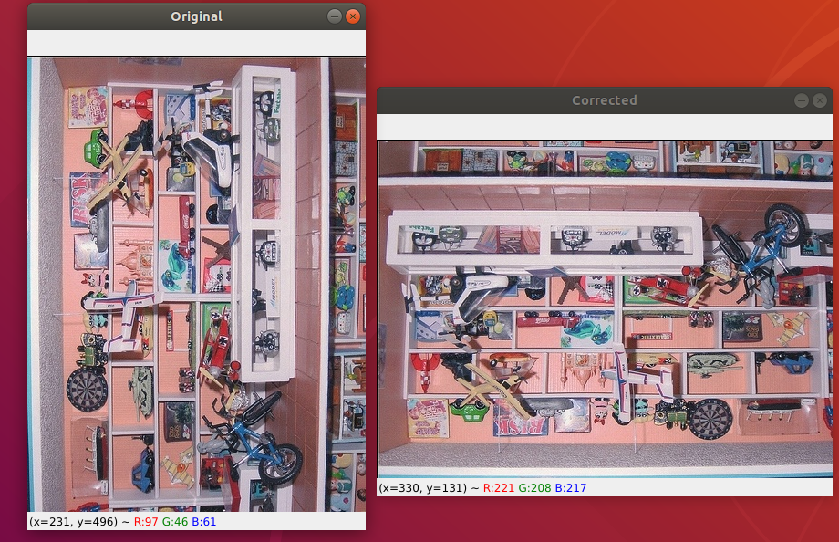
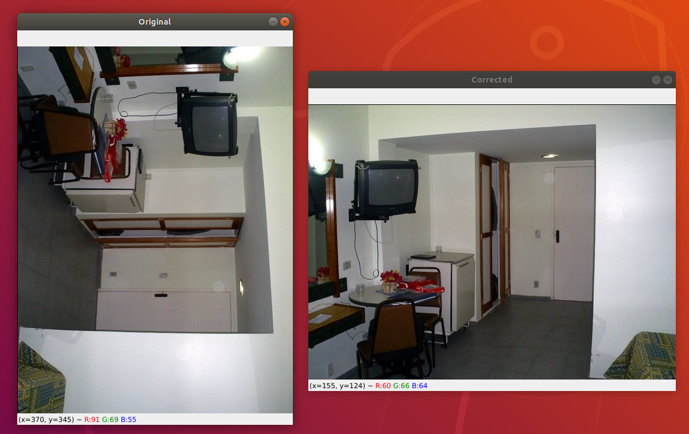
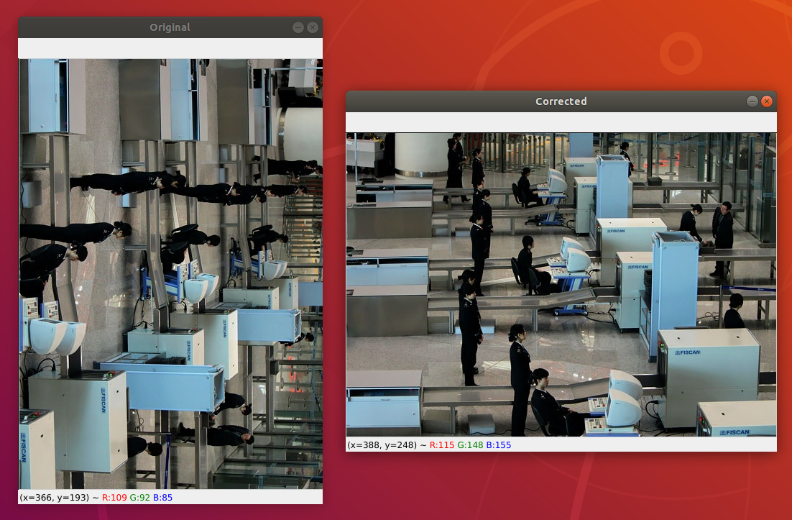

[CVPR Indoor Dataset]:
http://web.mit.edu/torralba/www/indoor.html

## Transfer learning via feature extraction

This example uses the VGG16 network pretrained on ImageNet as a feature extractor to train a model to recognise and fix image rotation.

### Dataset

Indoor Scene recognition dataset / Indoor CVPR dataset

We randomly sample 10,000 images from the dataset and apply a random rotation to it in the range of 0 - 270. 

Each sampled image is randomly rotated within the range of 0 - 270 degrees.

The rotated image is saved into the `rotated_images` folder in its sub-directory based on its rotation. e.g. `rotated_images\180\imgname.jpg`

This is implemented via the script `create_dataset.py`.

### Data Preprocessing

After the training dataset is created, we need to pass each rotated image through the pre-trained VGG16 Network to obtain the extracted features. 

The sub-directory in which each image is stored is used as the target label.

The features and labels are stored in a HDF5 file for training.

We apply minimal preprocessing to the image namely:
* Resize each image to 224x224 as required by VGG16 Input shape
* Apply mean normalization by subtracting the mean values from the VGG16 network

This is implemented in `extract_features.py`

### Training

The dataset is split into train/test sets with 75% for training and remaining 25% for testing.

The training process involves using the extracted features and building a LogisticRegression model.

We apply GridSearch to tune the hyperparameters with nested KFold cross validation to find the best regularization 'C' parameter for the model. The best perfoming estimator is serialized into a pickle file.

We perform grid search with kfold on the training set and evaluate its accuracy on the test set.

By running the training process, we obtain a mean accuracy of `0.90`:

```
[INFO] Tuning hyperparameters...
[INFO] Best hyperparams: {'C': 0.01}
[INFO] Evaluating model...
              precision    recall  f1-score   support

           0       0.93      0.92      0.93       608
         180       0.90      0.91      0.90       643
         270       0.90      0.88      0.89       619
          90       0.89      0.90      0.89       653

    accuracy                           0.90      2523
   macro avg       0.90      0.90      0.90      2523
weighted avg       0.90      0.90      0.90      2523
```

To test the model, we can run `orient_images.py` which randomly samples 10 random images from the `rotated_images` set.

It performs the following functions:
* Resize each sampled image into 224x244
* Mean normalization on each image using VGG16 utils
* Pass image into VGG16 feature extractor and reshape into 512*7*7 which matches the last maxpooling2d layer in VGG16 and the input shape of the model
* Loads best saved estimator
* Get prediction from saved estimator which is converted into its corresponding label i.e. angle of its rotation
* Apply reverse rotation to obain the original model

Below are some screenshots of orientation correction:





The first predicted image clearly shows that a 90 degree rotation should have been applied but the model incorrectly predicted a 180 degree rotation. Both the remaining examples show correct rotations, indicating that the model has predicted the right prior angle of rotation.

More training can be done to improve the overall accuracy by increasing the training set size and applying grid search to the `max_iter` parameter during training.

### Extensions

* Use larger training set

* Use more angles of rotation to generate training data

* Use grid search for max_iter parameter

* Apply another separate cross validation step with k-fold cross validation on the test set after a best estimator is created

### Final Model

To train the final model, we can fit the entire dataset during training without splitting into train/test sets.

### Deploying

This model is suitable for serving via Lambda as its meant to be a service for image rotation

This is left as an exercise to the reader....